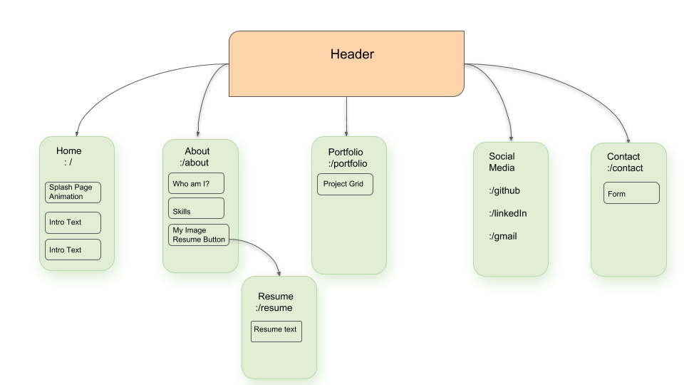

# My Portfolio
## Tanvi Garg

## Table of Contents
  1. [Project Plan](#plan)
  1. [Setup on OSX](#setup)
  2. [Technologies Used](#Tech-used)
  3. [MIT License](#mit-lic)

## Project Plan and Routing 

## Setup on OSX 

## Technologies Used 

